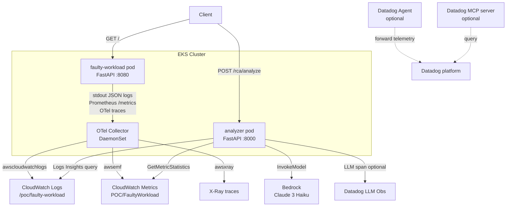

# Design

## Overview

This POC builds an observability and root-cause analysis pipeline for a Kubernetes workload running on EKS/EC2. The workload intentionally emits intermittent warnings, errors, latency spikes, and dependency timeouts so that the end-to-end telemetry and RCA path can be demonstrated and validated.

Telemetry (logs, metrics, traces) is collected by an OTel Collector DaemonSet and forwarded to CloudWatch. An analyzer service queries that CloudWatch data, compresses the evidence into a compact bundle, and sends it to Amazon Bedrock (Claude 3 Haiku) for root-cause analysis. The Bedrock call path is optionally instrumented with Datadog LLM Observability. A Datadog Agent migration is in progress; the analyzer currently queries CloudWatch directly.

**Scope boundary**: This document covers the faulty-workload service, the analyzer service, the OTel Collector configuration, and the CloudWatch + Bedrock integration. Datadog Agent wiring and MCP server are out-of-scope for implementation but are described in the architecture for completeness.

## Architecture



**Key design decisions:**

- OTel Collector as the single collection point — workload pods write to stdout and expose `/metrics`; the Collector scrapes and forwards, so the workload has no direct AWS SDK dependency.
- Analyzer is decoupled from the workload — it queries CloudWatch independently, so it can be run against any time window after the fact.
- Bedrock is called synchronously within the HTTP request cycle. The compact bundle keeps latency acceptable.
- Datadog LLM Observability is a conditional import — if `ddtrace` is not installed or `DD_LLMOBS_ENABLED != true`, all LLMObs code paths are no-ops and the analyzer returns identical results.

## Components and Interfaces

### faulty-workload (FastAPI, port 8080)

| Route | Method | Description |
|---|---|---|
| `/` | GET | Health check; fault injection applied on every call |
| `/metrics` | GET | Prometheus metrics (mounted ASGI app) |

**Fault injection** (`faults.py` — `apply_faults(request)`):
- HTTP 500 with probability `HTTP_500_PROBABILITY` (default 0.05) — raises `HTTPException` immediately.
- Latency spike 2–5 s with probability `LATENCY_SPIKE_PROBABILITY` (default 0.05) — `asyncio.sleep`, non-blocking.
- Dependency timeout every `TIMEOUT_EVERY_N` requests (default 50) — returns `FaultResult(warning_type="dependency_timeout")`.
- Memory pressure warning every `MEMORY_PRESSURE_THRESHOLD` requests (default 100) — returns `FaultResult(warning_type="memory_pressure")`.
- Bad payload when query param `payload=bad|malformed` — returns `FaultResult(warning_type="bad_payload")`.

**Logging** (`logger.py` — `JsonFormatter`):
Emits single-line JSON to stdout:
```
{"timestamp": "...", "service": "...", "severity": "...", "trace_id": "...",
 "request_id": "...", "error_type": "...", "message": "..."}
```
`trace_id` and `request_id` are resolved from `contextvars` (populated by `TraceContextMiddleware`) or from `extra=` on the log call.

**Metrics** (`metrics.py`):
- Counters: `request_count_total`, `warning_count_total{warning_type}`, `error_count_total`, `timeout_count_total`, `restart_count_total`
- Histogram: `latency_ms` — buckets `[10, 25, 50, 100, 250, 500, 1000, 2500, 5000, 10000]`

**Context propagation** (`context.py`):
`trace_id_var` and `request_id_var` are Python `ContextVar`s. `TraceContextMiddleware` reads `X-Trace-ID` / `X-Request-ID` request headers (generating UUIDs when absent) and stores them in the vars for the lifetime of the request.

---

### analyzer (FastAPI, port 8000)

| Route | Method | Description |
|---|---|---|
| `/` | GET | Jinja2 HTML UI (incident selector, evidence timeline, RCA card) |
| `/health` | GET | Liveness check |
| `/rca/analyze` | POST | Orchestrates CloudWatch query → bundle → Bedrock → RCA response |

**POST /rca/analyze — request model** (`AnalyzeRequest`):
```json
{
  "incident_id": "string",
  "service":     "string",
  "window_start": "2024-01-01T00:00:00Z",
  "window_end":   "2024-01-01T01:00:00Z",
  "namespace":    "optional string",
  "pod_name":     "optional string"
}
```

**POST /rca/analyze — response model** (`AnalyzeResponse`):
```json
{
  "root_cause":       "string",
  "evidence":         "string",
  "impact":           "string",
  "recommended_fix":  "string",
  "confidence":       0.85
}
```

**CloudWatch query layer** (`cloudwatch.py`):
- `query_logs(log_group, window_start, window_end, pod_name=None)` — Logs Insights query, polls every 1 s, max 30 attempts. Returns list of `{timestamp, severity, error_type, message, trace_id}`. Limit 20 results. Raises `TimeoutError` after 30 s; `RuntimeError` on query failure.
- `query_metrics(namespace, service, window_start, window_end)` — `GetMetricStatistics` for `request_count_total`, `error_count_total`, `warning_count_total`, `timeout_count_total` (Sum), and `latency_ms` p50/p99 (ExtendedStatistics). Returns delta (max − min) per metric over the window.

**Bundle builder** (`bundle.py` — `build_bundle(logs, metrics, traces=None)`):
Caps logs at top 10 most severe: ERROR before WARNING, then most-recent-first within each tier (using `_InvertedStr` for ISO-8601 lexicographic inversion). Returns:
```json
{
  "log_summary":     [...],  // max 10 entries
  "metric_deltas":   {...},  // key-value pairs as returned by query_metrics
  "trace_anomalies": [...]   // max 5 entries
}
```

**Bedrock RCA** (`bedrock.py`):
- `build_prompt(bundle)` — compact JSON prompt targeting < 500 tokens. Instructs Claude to return JSON-only with keys `root_cause`, `evidence`, `impact`, `recommended_fix`, `confidence`.
- `invoke_rca(bundle)` — calls `bedrock-runtime.invoke_model` with Anthropic Messages API format. Validates all 5 required keys are present. Optionally wraps call in a Datadog LLM span.

---

### OTel Collector (DaemonSet)

Pipeline: `otlp` receivers → `awscloudwatchlogs` + `awsemf` + `awsxray` exporters.
- Log group: `/poc/faulty-workload`
- Metric namespace: `POC/FaultyWorkload`

---

### CloudWatch resources

- **Dashboard** (`cloudwatch/dashboard.json`): error rate, warning count, latency P50/P99, restart count.
- **Alarms** (`cloudwatch/alarms.json`): `error_count > 10` / 5 min, latency P99 > 3000 ms, `restart_count > 2` / 10 min.

---

### Datadog LLM Observability (optional)

Enabled when `DD_LLMOBS_ENABLED=true` and `ddtrace` is installed. Initialised once at module import time in `bedrock.py`. Records: model name, model provider, input prompt, output text, approximate input/output token counts, error metadata. Gracefully degrades to a no-op otherwise.

---

### Datadog MCP server (optional)

Queries the same Datadog account as the telemetry destination. Not on the primary ingestion or RCA path; used for operator investigation, trace lookup, and LLM Observability validation.

## Data Models

### Log entry (CloudWatch Logs / workload stdout)

```json
{
  "timestamp":  "2024-01-15T12:34:56.789012Z",
  "service":    "faulty-workload",
  "severity":   "ERROR",
  "trace_id":   "a1b2c3d4-...",
  "request_id": "e5f6g7h8-...",
  "error_type": "http_exception",
  "message":    "Injected random internal server error"
}
```

Severity values: `DEBUG`, `INFO`, `WARNING`, `ERROR`, `CRITICAL`.
`error_type` values: `http_exception`, `dependency_timeout`, `memory_pressure`, `bad_payload`, `""` (healthy).

### Metric delta record (returned by `query_metrics`)

```python
{
  "request_count":  float,   # delta (max − min) of request_count_total Sum over window
  "error_count":    float,
  "warning_count":  float,
  "timeout_count":  float,
  "latency_p50_ms": float,   # delta of p50 extended stat
  "latency_p99_ms": float,
}
```

### Incident bundle (input to Bedrock)

```json
{
  "log_summary": [
    {"timestamp": "...", "severity": "ERROR", "error_type": "...", "message": "...", "trace_id": "..."}
  ],
  "metric_deltas": {
    "request_count": 120.0, "error_count": 6.0, "warning_count": 3.0,
    "timeout_count": 2.0, "latency_p50_ms": 45.0, "latency_p99_ms": 3200.0
  },
  "trace_anomalies": []
}
```

`log_summary` is capped at 10 entries; `trace_anomalies` at 5.

### Bedrock RCA response

```json
{
  "root_cause":      "string",
  "evidence":        "string",
  "impact":          "string",
  "recommended_fix": "string",
  "confidence":      0.85
}
```

All five keys are required. Missing any key causes a `ValueError` and the analyzer returns HTTP 502.

### Environment / configuration variables

| Variable | Default | Used by |
|---|---|---|
| `FAULT_SAMPLE_RATE` | `0.1` | faulty-workload |
| `HTTP_500_PROBABILITY` | `0.05` | faulty-workload |
| `LATENCY_SPIKE_PROBABILITY` | `0.05` | faulty-workload |
| `LATENCY_SPIKE_MIN_S` | `2.0` | faulty-workload |
| `LATENCY_SPIKE_MAX_S` | `5.0` | faulty-workload |
| `TIMEOUT_EVERY_N` | `50` | faulty-workload |
| `MEMORY_PRESSURE_THRESHOLD` | `100` | faulty-workload |
| `SERVICE_NAME` | `faulty-workload` | faulty-workload |
| `LOG_GROUP` | `/poc/faulty-workload` | analyzer |
| `METRIC_NAMESPACE` | `POC/FaultyWorkload` | analyzer |
| `BEDROCK_MODEL_ID` | `anthropic.claude-3-haiku-20240307-v1:0` | analyzer |
| `BEDROCK_MAX_TOKENS` | `512` | analyzer |
| `DD_LLMOBS_ENABLED` | `false` | analyzer |
| `DD_LLMOBS_ML_APP` | `cloudwatch-rca-poc` | analyzer |
| `DD_LLMOBS_AGENTLESS_ENABLED` | `true` | analyzer |
| `DD_SITE` | `datadoghq.com` | analyzer |
| `DD_API_KEY` | — | analyzer |

## Correctness Properties

*A property is a characteristic or behavior that should hold true across all valid executions of a system — essentially, a formal statement about what the system should do. Properties serve as the bridge between human-readable specifications and machine-verifiable correctness guarantees.*

The features best suited for property-based testing in this POC are the pure-function layers: fault injection scheduling, bundle construction, and prompt building. CloudWatch and Bedrock interactions are integration concerns and are covered by example-based tests.

### Property 1: Timeout fault fires exactly on period boundaries

*For any* positive integer `n` (TIMEOUT_EVERY_N) and any sequence of request counts, the dependency-timeout fault result is produced if and only if the request count is a positive multiple of `n`.

**Validates: Requirements 1.1**

### Property 2: Memory pressure fault fires exactly on period boundaries

*For any* positive integer `m` (MEMORY_PRESSURE_THRESHOLD) and any sequence of request counts, the memory-pressure fault result is produced if and only if the request count is a positive multiple of `m`.

**Validates: Requirements 1.1**

### Property 3: Bundle log cap and severity ordering

*For any* list of log entries with arbitrary severities and timestamps, `build_bundle` returns a `log_summary` of length at most 10, where all ERROR entries appear before any WARNING entries, and within each severity tier entries are ordered most-recent first.

**Validates: Requirements 1.3**

### Property 4: Bundle trace cap

*For any* list of trace anomaly dicts of arbitrary length, `build_bundle` returns a `trace_anomalies` list of length at most 5.

**Validates: Requirements 1.3**

*Note: Properties 3 and 4 are kept separate because they test independent invariants (log ordering vs. trace truncation) of the same function. They can be implemented as a single parameterised test or two focused tests.*

### Property 5: Prompt always contains required RCA instructions

*For any* valid incident bundle (log_summary, metric_deltas, trace_anomalies), `build_prompt` returns a string that contains all five required JSON key names (`root_cause`, `evidence`, `impact`, `recommended_fix`, `confidence`) and requests JSON-only output.

**Validates: Requirements 1.4**

### Property 6: Required-key validation is complete

*For any* dict that is missing at least one of the five required keys (`root_cause`, `evidence`, `impact`, `recommended_fix`, `confidence`), the key-validation logic raises `ValueError`. Conversely, a dict that contains all five keys (plus any additional keys) passes validation.

**Validates: Requirements 1.4**

## Error Handling

### analyzer service

| Condition | Behavior |
|---|---|
| CloudWatch Logs Insights query times out (> 30 s) | Raises `TimeoutError`; `app.py` catches and returns HTTP 502 |
| CloudWatch Logs Insights query fails or is cancelled | Raises `RuntimeError`; `app.py` catches and returns HTTP 502 |
| No CloudWatch data found (empty logs and zero metrics) | Returns HTTP 404 with detail message |
| Bedrock returns non-JSON output | `json.JSONDecodeError` caught in `app.py`; returns HTTP 502 |
| Bedrock response missing required keys | `ValueError` raised in `bedrock.py`; caught in `app.py`; returns HTTP 502 |
| Datadog LLM Observability unavailable / disabled | `_llmobs_enabled()` returns False; all LLMObs paths skipped; RCA proceeds normally |
| `DD_API_KEY` missing when LLMObs enabled | `_init_llmobs` logs a warning; `_llmobs_initialized` stays False; graceful degradation |

### faulty-workload service

| Condition | Behavior |
|---|---|
| Random HTTP 500 fault | `HTTPException(500)` raised in `apply_faults`; `error_count` incremented; logged at ERROR |
| Latency spike | `asyncio.sleep` (non-blocking); latency histogram updated; no error logged |
| Dependency timeout warning | `FaultResult` returned from `apply_faults`; logged at WARNING; `timeout_count` incremented |
| Memory pressure warning | `FaultResult` returned; logged at WARNING; `warning_count` incremented |
| Bad payload warning | `FaultResult` returned; logged at WARNING; `warning_count` incremented |

### CloudWatch query layer

- `query_logs` raises `TimeoutError` after 30 polling attempts (one per second).
- `query_logs` raises `RuntimeError` when CloudWatch returns status `"Failed"` or `"Cancelled"`.
- `query_metrics` returns `0.0` for any metric that has no datapoints in the window (no exception).

## Testing Strategy

### Approach

A dual-layer strategy is used:

1. **Unit / property tests** — pure-function logic in `bundle.py`, `bedrock.py` (prompt building, key validation), and `faults.py` (scheduling logic). Uses `pytest` and `hypothesis` for property-based testing.
2. **Integration tests** — CloudWatch queries, Bedrock invocations, and OTel Collector pipeline. Uses `pytest` with AWS mocks (`moto`) or live AWS accounts in a dedicated POC environment.

### Property-based tests (`hypothesis`)

Each property test runs a minimum of 100 iterations. Tests are tagged with a comment referencing the design property.

```
# Feature: cloudwatch-poc, Property 1: timeout fault fires on period boundaries
# Feature: cloudwatch-poc, Property 2: memory pressure fault fires on period boundaries
# Feature: cloudwatch-poc, Property 3: bundle log cap and severity ordering
# Feature: cloudwatch-poc, Property 4: bundle trace cap
# Feature: cloudwatch-poc, Property 5: prompt always contains required RCA instructions
# Feature: cloudwatch-poc, Property 6: required-key validation is complete
```

**Property 1 & 2 (fault scheduling):** Generate `(n, request_count)` pairs; call `_maybe_timeout` / `_maybe_memory_pressure` directly; assert `FaultResult` is returned iff `request_count % n == 0 and request_count > 0`.

**Property 3 (bundle severity ordering):** Generate lists of log dicts with random `severity` values from `{ERROR, WARNING, OTHER}` and random ISO-8601 timestamps; call `build_bundle`; assert all ERRORs precede all WARNINGs in `log_summary`, length ≤ 10, timestamps within each tier are non-increasing.

**Property 4 (bundle trace cap):** Generate lists of trace dicts of arbitrary length; call `build_bundle`; assert `len(trace_anomalies) <= 5`.

**Property 5 (prompt completeness):** Generate random bundle dicts (varying log counts, metric values, trace counts); call `build_prompt`; assert all five key names appear in the returned string.

**Property 6 (key validation):** Generate dicts with random subsets of required keys plus random extra keys; assert validation raises `ValueError` iff any required key is absent.

### Unit / example tests

- `JsonFormatter.format()` — verify output is valid JSON with all required fields for a sample `LogRecord`.
- `TraceContextMiddleware` — verify UUID generation when headers absent; verify echo in response headers.
- `build_bundle` with empty inputs — verify returns `{log_summary: [], metric_deltas: {}, trace_anomalies: []}`.
- `invoke_rca` with a mocked Bedrock client — verify correct Anthropic Messages API body shape, correct model ID used, correct key extraction from content blocks.

### Integration tests

- `query_logs` against a real or moto-mocked CloudWatch Logs — verify polling loop, pod_name filter, field mapping.
- `query_metrics` — verify all six metric keys are returned, `0.0` default when no datapoints.
- End-to-end `POST /rca/analyze` with mocked CloudWatch and Bedrock — verify HTTP 404 on empty data, HTTP 502 on missing Bedrock keys, HTTP 200 with valid RCA shape.

### Smoke tests

- Deployed pod emits at least one ERROR and one WARNING within a 5-minute window.
- CloudWatch Logs group `/poc/faulty-workload` receives structured JSON entries.
- `GET /health` on the analyzer returns `{"status": "ok"}`.
- (Optional) Datadog LLM Observability span appears in the Datadog UI after one `POST /rca/analyze` with `DD_LLMOBS_ENABLED=true`.
